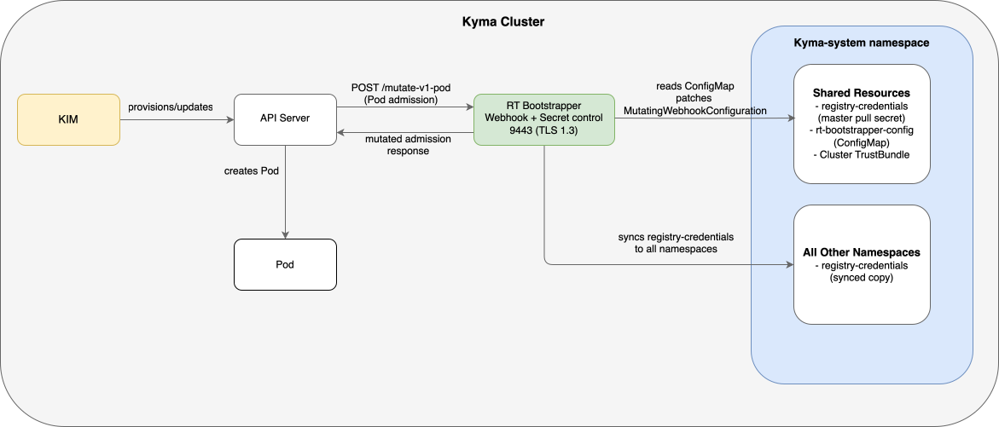

# System Scope and Context

## Business Context

Runtime Bootstrapper sits inside a Kyma runtime cluster and acts as a transparent infrastructure adapter. Its external communication partners are the following:

| Partner                           | Interaction                                                                                                                                                                    |
|-----------------------------------|--------------------------------------------------------------------------------------------------------------------------------------------------------------------------------|
| Kubernetes API server             | Calls the webhook's HTTPS endpoint (`/mutate--v1-pod`) for every Pod creation request. Runtime Bootstrapper returns the modified (or unmodified) Pod admission response.       |
| Kyma Infrastructure Manager (KIM) | Manages the lifecycle of Runtime Bootstrapper (installs, updates, removes). Provides the pull secret and the webhook ConfigMap (`rt-bootstrapper-config`).                     |
| Kyma Lifecycle Manager (KLM)      | Deploys Kyma module operators, which in turn create Pods. Those Pods are intercepted by the webhook. KLM has no direct interface with Runtime Bootstrapper.                    |
| Private container registry        | Workloads pull images from the rewritten registry URLs. Runtime Bootstrapper injects the pull secret reference; the registry is not called by the webhook itself.              |
| BTP backend services              | Workloads communicate with BTP services using the CA certificates mounted via `ClusterTrustBundle`. Runtime Bootstrapper mounts the bundle; it does not connect to BTP itself. |
| Kyma runtime namespaces           | The secret controller continuously mirrors the pull secret into every namespace so that Pods in any namespace can authenticate against the private registry.                   |

## Technical Context

| Channel                            | Protocol                   | Direction                                                                                           |
|------------------------------------|----------------------------|-----------------------------------------------------------------------------------------------------|
| API server → webhook               | HTTPS (TLS 1.3), port 9443 | Inbound                                                                                             |
| Webhook → Kubernetes API           | HTTPS (in-cluster)         | Outbound – reads namespace, ConfigMap; patches `MutatingWebhookConfiguration`                       |
| Secret controller → Kubernetes API | HTTPS (in-cluster)         | Outbound – reads/patches Secrets, lists Namespaces                                                  |
| KIM → Kubernetes API               | HTTPS                      | Outbound – manages webhook deployment; shares resources such as pull secrets, cluster trust bundles |
