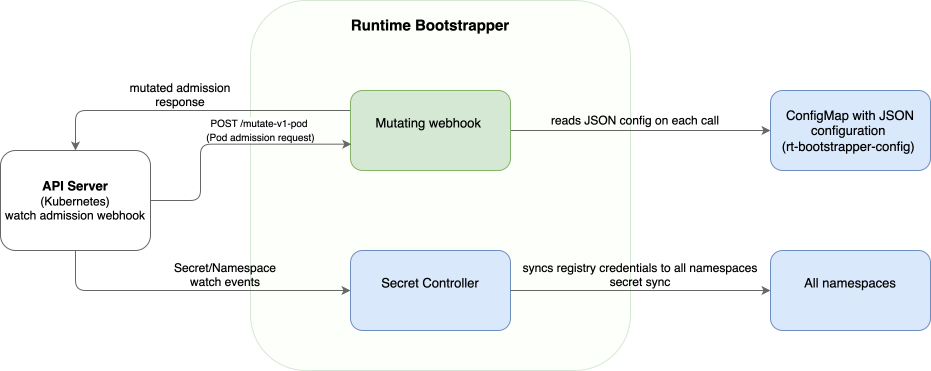

# Building Block View

## Level 1 – Overall System



| Building Block    | Responsibility                                                                                                                                       |
|-------------------|------------------------------------------------------------------------------------------------------------------------------------------------------|
| Mutating webhook  | Intercepts Pod creation requests from the Kubernetes API server and applies landscape-specific modifications based on configuration and annotations. |
| Secret controller | Watches the master image-pull Secret in `kyma-system` and synchronizes it to all other cluster namespaces.                                           |
| CTB watcher       | Watches the named `ClusterTrustBundle` for content changes and triggers pod restarts when the CA hash changes.                                        |
| Configuration API | Defines the `Config` struct, feature annotation constants, validation, and JSON (de)serialization for the webhook's runtime configuration.           |

---

## Level 2 – Mutating Webhook

```
internal/webhook/
├── server/          – Custom TLS webhook server with hot-reload and caBundle callback
├── certificate/     – Patches MutatingWebhookConfiguration.caBundle on cert renewal
├── k8s/             – Stateless helpers: image registry rewriting, ClusterTrustBundle volume types
└── v1/
    ├── pod_webhook.go          – Registers the webhook; builds the annotation-dispatch chain
    ├── pod_defaulters.go       – PodDefaulter implementations (registry, pull Secret, trust bundle)
    └── pod_defaulter_fips_mode.go – FIPS-mode environment-variable defaulter
```

### Webhook Server (internal/webhook/server/)

A custom implementation of `sigs.k8s.io/controller-runtime/pkg/webhook.Server`. It wraps `certwatcher` to hot-reload TLS certificates from disk without restarting the process. When a new certificate is loaded, a user-supplied `Callback(tls.Certificate)` is invoked – in `cmd/main.go` this callback reads `ca.crt` from the cert directory and patches the `caBundle` of the `MutatingWebhookConfiguration`.

- Listens on port `9443` (default), TLS 1.3 minimum, HTTP/2 disabled by default.
- Exposes `StartedChecker()` as both the health and readiness probe.

### Certificate Updater (internal/webhook/certificate/)

`BuildUpdateCABundle` returns a closure that reads the current `MutatingWebhookConfiguration` from the API server and patches all webhooks' `clientConfig.caBundle` fields using server-side apply. Invoked by the cert-reload callback in the webhook server; retried on conflict using `client-go`'s `RetryOnConflict`.

### Pod Webhook (internal/webhook/v1/)

`SetupPodWebhookWithManager` wires a `podCustomDefaulter` into the controller-manager. On every Pod admission request, `podCustomDefaulter.Default()` performs the following actions:

1. Fetches the Pod's namespace annotations from the API server.
2. Resolves per-namespace defaults from `Config.NamespaceDefaultFeatures`.
3. Expands any `rt-cfg.kyma-project.io/all` aliases using `Config.AvailableFeatures`.
4. Iterates over the registered `PodDefaulter` functions; each one checks whether its activation annotation is present in any of the three annotation layers (namespace defaults, namespace annotations, Pod annotations) and applies its modification if so.
5. If any defaulter modified the Pod, stamps `rt-bootstrapper.kyma-project.io/modified: "true"` on the Pod.

`PodDefaulter` type: `func(pod *corev1.Pod, nsAnnotations map[string]string, cfg *apiv1.Config) (bool, error)`

Each feature is implemented as a constructor returning this function type.

For a user-facing description of each manipulation (purpose, modified manifest fields, opt-in annotation), see [Pod Manipulations](02-01-pod-manipulations.md).

The table below maps each manipulation to its Go constructor and feature annotation key:

| Constructor                              | Feature annotation                                | What it does                                                                                            |
|------------------------------------------|---------------------------------------------------|---------------------------------------------------------------------------------------------------------|
| `BuildPodDefaulterAlterImgRegistry()`    | `rt-cfg.kyma-project.io/alter-img-registry`       | Rewrites the registry hostname of every container (and init-container) image using `cfg.Overrides`.     |
| `BuildPodDefaulterAddImagePullSecrets()` | `rt-cfg.kyma-project.io/add-img-pull-Secret`      | Appends the configured Secret name to `spec.imagePullSecrets` if not already present.                   |
| `BuildDefaulterAddClusterTrustBundle()`  | `rt-cfg.kyma-project.io/add-cluster-trust-bundle` | Adds a projected `ClusterTrustBundle` volume, mounts it into every container at the configured path, and stamps a `ctb-hash` annotation on every CTB-opted-in pod (regardless of opt-in source). Supports explicit opt-out via `"false"`. |
| `BuildDefaulterFipsMode()`               | `rt-cfg.kyma-project.io/set-fips-mode`            | Sets `KYMA_FIPS_MODE_ENABLED=true` and `FIPS_MODE_ENABLED=true` in every init-container and container.  |
| `BuildDefaulterSetLandscape()`           | `rt-cfg.kyma-project.io/set-landscape`            | Sets `KYMA_LANDSCAPE=<value>` in every init-container and container. The landscape value is supplied via the `--landscape` flag at startup. |

Only defaulters whose annotation key appears in `Config.AvailableFeatures` are registered at startup; the others are silently excluded.

### Kubernetes Utilities (internal/webhook/k8s/)

Stateless functions with no Kubernetes client dependency:

- `AlterPodImageRegistry(image, overrides)` – parses the image string, identifies whether a registry host is present, and applies the override map.
- `Contains(l, r map[string]string)` – checks whether all key-value pairs in `r` are present in `l` (used for annotation matching).
- `ClusterTrustBundle` struct – builds the `corev1.Volume` (projected) and `corev1.VolumeMount` for the trust bundle injection.

---

## Level 2 – CTB Watcher

```
internal/ctb/
├── hash_holder.go    – Thread-safe in-memory store for the current CTB hash
├── watcher.go        – Controller watching the named ClusterTrustBundle for changes
└── restarter.go      – Scans namespaces and deletes pods with stale CTB hashes
```

### HashHolder (`internal/ctb/hash_holder.go`)

A thread-safe in-memory store (`sync.RWMutex`) shared between the webhook (reads) and the CTB watcher (writes). Holds the SHA-256 hash of the current `ClusterTrustBundle` content. `ComputeAndSet(trustBundle)` hashes the content and stores the result atomically.

### CTB Watcher Controller (`internal/ctb/watcher.go`)

A controller-runtime controller that watches the named `ClusterTrustBundle` resource. On each reconciliation:

1. Reads the `ClusterTrustBundle` and computes a SHA-256 hash of `spec.trustBundle`.
2. Updates the `HashHolder` with the new hash.
3. If the hash changed, calls `RestartStalePods` to delete pods with stale hashes.
4. Requeues after 10 seconds if any pods were deleted (convergence loop), otherwise requeues after a configurable resync interval (default: 5 minutes).

A predicate filter ensures only events for the configured CTB name are processed.

### Pre-Computation (`internal/ctb/watcher.go`)

`PreComputeHash` reads the named CTB and initializes the `HashHolder` before the manager starts. This eliminates a race condition where the webhook could stamp an empty hash on pods created before the watcher's first reconciliation. If the CTB does not exist yet, the failure is non-fatal — the hash stays empty until the CTB appears.

### Pod Restarter (`internal/ctb/restarter.go`)

`RestartStalePods` iterates all namespaces, lists pods in each, and deletes those where:
- The pod annotation `rt-cfg.kyma-project.io/add-cluster-trust-bundle` is `"true"`
- The pod has an `OwnerReference` (orphan pods are never deleted)
- The pod's `rt-bootstrapper.kyma-project.io/ctb-hash` annotation differs from the desired hash, or is missing entirely (treated as stale)

When a namespace returns HTTP 403, the restarter logs a warning and skips the namespace. To extend restart coverage to additional namespaces, grant the rt-bootstrapper ServiceAccount `pods` `list` and `delete` RBAC permissions in those namespaces.

---

## Level 2 – Secret Controller

```
internal/controller/
├── secret_controller.go         – Reconciler: syncs master Secret to all namespaces
├── create_ns_predicate.go       – Passes only namespace create events (excludes master namespace)
└── master_secret_predicate.go   – Passes only create/update events for the named master Secret
```

`SecretReconciler` watches two resource types using separate `Watches` calls, each filtered by a predicate:

| Watch target       | Predicate                                                                                                                       | Reconcile path                                                                                                                                                              |
|--------------------|---------------------------------------------------------------------------------------------------------------------------------|-----------------------------------------------------------------------------------------------------------------------------------------------------------------------------|
| `corev1.Namespace` | `createNsPredicate` – create only, excludes master Secret namespace                                                             | Creates a copy of the master secret in the new namespace.                                                                                                                   |
| `corev1.Secret`    | `masterSecret` – create/update only, name must match master Secret; update only fires when `.dockerconfigjson` actually changed | If from `kyma-system`: iterates all namespaces and patches each one. If from another namespace: patches that single namespace's copy. Re-queues after `SecretSyncInterval`. |

All Secret copies are created/updated with `client.Apply` (server-side apply), using `rt-bootstrapper` as the field manager.

---

## Level 2 – Configuration API

```
pkg/api/v1/
└── types.go    – Config struct, feature constants, NewConfig(), validation
```

`Config` (JSON, loaded from ConfigMap key `rt-bootstrapper-config.json`):

| Field                | Type                  | Purpose                                                                                                                                  |
|----------------------|-----------------------|------------------------------------------------------------------------------------------------------------------------------------------|
| `overrides`          | `map[string]string`   | Registry hostname rewrites: `{"old.registry": "new.registry"}`                                                                           |
| `clusterTrustBundle` | `*ClusterTrustBundle` | Specifies the `ClusterTrustBundle` name, volume name, mount path, and cert write path.                                                   |
| `namespaceFeatures`  | `*NamespaceFeatures`  | Per-namespace list of feature annotation keys (or `rt-cfg.kyma-project.io/all`) that apply as defaults to all Pods in that namespace.    |
| `availableFeatures`  | `[]string`            | Allowlist of feature annotation keys that can be activated. Must be a subset of `KnownFeatureKeys`. Empty means no features are enabled. |

`NewConfig(r io.Reader)` decodes the JSON, validates required fields with `go-playground/validator`, then cross-validates `namespaceFeatures` entries against `availableFeatures`.

For a concrete configuration example, see [Cross-Cutting Concepts – Configuration Model](01-08-crosscutting-concepts.md#configuration-model).
