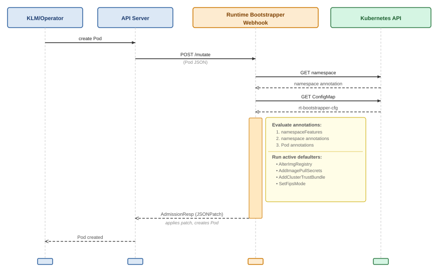
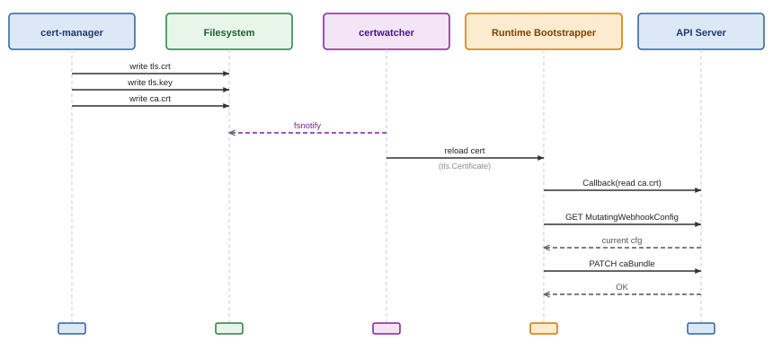
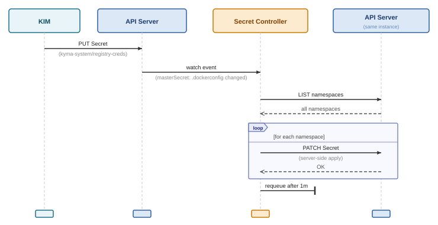
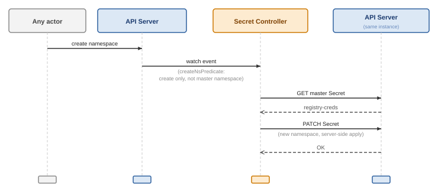

# Runtime View

## Scenario 1 – Pod Creation (Webhook Manipulation)

This is the primary runtime scenario: a Kyma module operator creates a Pod in an opted-in namespace.

**Notes:**
- If the webhook cannot be reached, `failurePolicy: Ignore` causes the API server to admit the Pod unmodified.
- The config is re-read from the API server on every invocation; there is no in-process cache.
- A panic in any defaulter is recovered and returned as an admission error.
- If no defaulter modifies the Pod, the response carries no patch (no-op admission).

---

## Scenario 2 – Certificate Rotation

When cert-manager renews the webhook's TLS certificate and writes the new files to the cert directory:

**Notes:**
- `certwatcher` watches the cert files using `fsnotify`; no polling.
- `BuildUpdateCABundle` wraps the patch in a `RetryOnConflict` loop.
- The patch uses server-side apply with `rt-bootstrapper-webhook` as the field manager.

---

## Scenario 3 – Pull Secret Synchronization (Master Secret Updated)

When KIM pushes an updated pull secret to `kyma-system`:

**Notes:**
- The `masterSecret` predicate fires only when `.dockerconfigjson` actually changed (byte-level comparison), suppressing no-op updates.
- Each namespace patch uses server-side apply; concurrent updates from other sources are handled by field ownership.
- After a full sync the reconciler re-queues itself after `SecretSyncInterval` (default: 1 minute) for periodic drift correction.

---

## Scenario 4 – New Namespace Created

When any namespace is created in the cluster:

**Notes:**
- The `createNsPredicate` explicitly excludes the `kyma-system` namespace (the master Secret's home) to avoid a recursive patch loop.
- If the master Secret does not exist yet, the `GET` fails and the reconciliation returns an error, triggering standard controller-runtime backoff retry.

---

## Scenario 5 – ClusterTrustBundle CA Change (Pod Restart)

When the CA certificates in the `ClusterTrustBundle` are rotated or updated, the following actions take place:

1. The CTB watcher controller receives a reconciliation event for the named `ClusterTrustBundle`.
2. The watcher reads the `spec.trustBundle` content and computes a SHA-256 hash.
3. The new hash is compared with the previously stored hash in the `HashHolder`.
4. If the hash changed, `RestartStalePods` scans all namespaces for Pods with annotation `rt-cfg.kyma-project.io/add-cluster-trust-bundle: "true"` whose `rt-bootstrapper.kyma-project.io/ctb-hash` does not match the new hash or is missing entirely.
5. Stale Pods (with an owner) are deleted. The owning controller (for example, a ReplicaSet) recreates them.
6. On recreation, the webhook stamps the new hash using the `HashHolder` during admission.
7. The watcher requeues after 10 seconds to verify convergence. Once all Pods have the correct hash, the resync interval returns to its default (5 minutes).

**Notes:**
- Only Pods managed by an owner (for example, a ReplicaSet or StatefulSet) are deleted. Orphan pods are logged with a warning and skipped.
- If the watcher cannot list Pods in a namespace (HTTP 403), it logs a warning and skips that namespace. To extend restart coverage to additional namespaces, grant the Runtime Bootstrapper ServiceAccount Pods `list` and `delete` RBAC permissions in those namespaces.
- At startup, `PreComputeHash` initializes the hash from the existing `ClusterTrustBundle` before the manager starts. This prevents a thundering-herd restart on first boot or upgrade.
- While the hash is empty (for example, before the CTB exists), no Pods are deleted, and no hash annotation is stamped.
