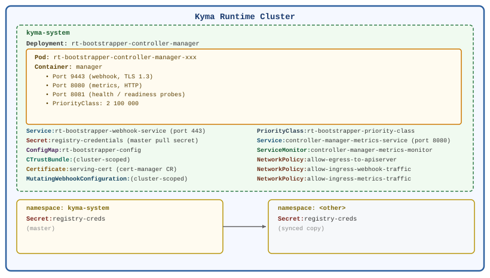

# Deployment View

## Infrastructure Level 1 – Kyma Runtime Cluster

Runtime Bootstrapper runs as a single Deployment inside the `kyma-system` namespace of every Kyma runtime cluster. KIM is responsible for deploying and updating it.

## Mapping of Building Blocks to Infrastructure

| Software Component                  | Kubernetes Resource                                                             | Namespace             |
|-------------------------------------|---------------------------------------------------------------------------------|-----------------------|
| Webhook + Secret Controller process | `Deployment` `rt-bootstrapper-controller-manager`                               | `kyma-system`         |
| Webhook TLS endpoint                | `Service` `rt-bootstrapper-webhook-service` (port 443 → 9443)                   | `kyma-system`         |
| TLS certificate                     | `Certificate` `serving-cert` (cert-manager CR)                                  | `kyma-system`         |
| Webhook registration                | `MutatingWebhookConfiguration` `rt-bootstrapper-mutating-webhook-configuration` | cluster-scoped        |
| Runtime configuration               | `ConfigMap` `rt-bootstrapper-config` (key: `rt-bootstrapper-config.json`)       | `kyma-system`         |
| Master pull Secret                  | `Secret` `registry-credentials`                                                 | `kyma-system`         |
| Synced pull Secrets                 | `Secret` `registry-credentials`                                                 | every other namespace |
| CA trust chain                      | `ClusterTrustBundle` (name configured in ConfigMap)                             | cluster-scoped        |
| Scheduling priority                 | `PriorityClass` `rt-bootstrapper-priority-class` (value 2 100 000)              | cluster-scoped        |
| Metrics endpoint                    | `Service` `controller-manager-metrics-service` (port 8080)                      | `kyma-system`         |
| Metrics scraping                    | `ServiceMonitor` `controller-manager-metrics-monitor`                           | `kyma-system`         |
| Network traffic rules               | `NetworkPolicy` `allow-egress-to-apiserver` (TCP 443 egress to API server)      | `kyma-system`         |
|                                     | `NetworkPolicy` `allow-ingress-webhook-traffic` (TCP 9443 ingress)              | `kyma-system`         |
|                                     | `NetworkPolicy` `allow-ingress-metrics-traffic` (TCP 8080 ingress)              | `kyma-system`         |

## Infrastructure Level 2 – Kustomize Overlays

Two kustomize overlays produce different install manifests:

| Overlay           | Target            | Certificate source                                                            | Use case                        |
|-------------------|-------------------|-------------------------------------------------------------------------------|---------------------------------|
| `config/default/` | BTP / production  | Gardener `Certificate` CR (`config/gardener/certmanager/`)                    | Production Kyma runtime         |
| `config/k3d/`     | Local k3d cluster | `ClusterTrustBundle` from a local CA (`config/k3d/cluster_trust_bundle.yaml`) | Local development and e2e tests |

Both overlays deploy the same binary; differences are limited to certificate provisioning and the `MutatingWebhookConfiguration` patch.
