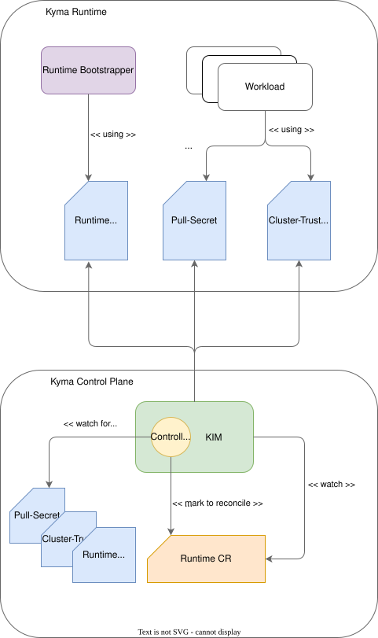

# Configuration Synchronization Using Controller Loop

Runtime Bootstrapper synchronizes several resources between Kyma Control Plane (KCP) and Kyma runtimes. Some webhook features require specific resources to work, for example, a pull secret to access a private container registry, `ClusterTrustBundle` to interact with BTP backend services, etc.

> ### Note:
> This document describes the current (interim) synchronization mechanism. The planned long-term replacement is captured in [ADR-007 – Direct Runtime Configuration Synchronization](adr/adr-007-direct-runtime-configuration-sync.md).

## Components

### Controller Loop

A controller loop is a custom Kubernetes controller that observes changes to selected cluster resources in KCP and initiates downstream actions. The watched resources are copied to Kyma runtimes. Each resource change must be synchronized from KCP to Kyma runtimes.

### Watched Resources

The controller loop monitors the following Kubernetes objects:

| Resource Type | Purpose |
| --- | --- |
| Pull secret | Provides authentication credentials for pulling container images from private registries. |
| `ClusterTrustBundle` | Supplies trust anchors (for example, CA certificates) required by runtimes that interact with the BTP backend services. |
| Webhook ConfigMap | Contains configuration for the Runtime Bootstrapper webhook. |

### Runtime Custom Resource

A custom resource (CR) representing a managed runtime instance.

Kyma Infrastructure Manager (KIM) reacts to Runtime CR labels to determine if a runtime requires reconciliation.

### Kyma Infrastructure Manager (KIM)

The Infrastructure Manager watches the Runtime CR for modifications. If it detects the label to force a reconciliation, it reconciles the target SKR and also synchronizes the shared resources.

## Current Behavior

### Change Detection

The controller loop continuously watches the pull secret, `ClusterTrustBundle`, and the webhook ConfigMap.

Whenever one of these resources is created, updated, or deleted, the controller receives an event.

### Triggering Reconciliation Through Labeling

Upon detecting a change, the controller loop performs the following steps:

1. Identifies all affected `Runtime` CR objects.
2. Applies or updates a specific label (for example, [`operator.kyma-project.io/force-patch-reconciliation=true`](https://github.com/kyma-project/kyma-infrastructure-manager/blob/c1d2f48a9b446b3374528278b46ea9be23ff622a/pkg/reconciler/annotations_utils.go#L4C32-L4C83)) on each `Runtime` CR.
3. KIM observes this label change.
4. KIM reconciles the corresponding runtimes to ensure they receive the updated configuration.

This mechanism uses the `Runtime` CR label as a signaling channel between the controller loop and the Kyma Infrastructure Manager.

### Rationale for the Interim Approach

The labeling strategy provides a lightweight and low-risk integration path with the following advantages:

* No direct modification of runtime resources is required.
* Existing reconciliation logic in KIM remains unchanged.
* The controller loop only signals intent rather than performing the full synchronization.

This allows incremental rollout and testing of the controller loop without impacting runtime stability.
