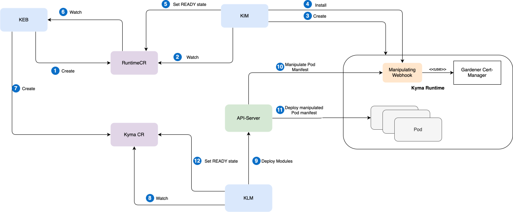

# Runtime Bootstrapper

## Overview

Kyma landscapes may require unique infrastructure setups, such as private container registries, certificate-based access mechanisms, or other specialized configurations tailored to specific contexts or markets. These setups make each Kyma landscape distinct.

By default, Kyma modules are not designed to accommodate these landscape-specific differences. Without adjustments, they may face functional limitations, incompatibilities, or fail to operate within such landscapes.

To ensure compatibility and functionality across diverse landscapes, Runtime Bootstrapper applies landscape-specific configurations to Kyma modules and the workloads the configurations install.

Runtime Bootstrapper is implemented as a mutating webhook that intercepts `create` requests for Pods before they are applied by Kubernetes `kubelet`. It modifies or rewrites parts of the Pod manifests to align them with the landscape requirements.

> ### Note:
> The webhook intercepts only Pods. Other resources, such as Deployments, DaemonSets, or StatefulSets, are ignored.

## Pod Manipulations

Runtime Bootstrapper supports five manipulations that can be applied to Pod manifests. For a full reference including opt-in annotations and a worked example, see [Pod Manipulations](02-01-pod-manipulations.md).

## High Level Flow

1. Runtime Provisioning Initiation: Kyma Environment Broker (KEB) creates a Runtime custom resource (CR), which represents a Kyma runtime instance.

2. Runtime CR Monitoring: Kyma Infrastructure Manager (KIM) continuously monitors changes to Runtime CRs.

3. Kyma Runtime Provisioning: When a new Runtime CR is created, KIM provisions a new Kyma runtime based on a Gardener Cluster.

4. Webhook Installation: Once the Kyma runtime is ready, KIM automatically installs the Runtime Bootstrapper webhook.

5. Runtime CR Readiness: After the webhook is operational, KIM marks the Runtime CR as `Ready`.

6. Runtime CR Status Monitoring: KEB monitors the status changes of Runtime CRs.

7. Kyma Installation Initiation: After the Runtime is ready, KEB creates a Kyma CR, which represents a Kyma installation in the runtime.

8. Kyma CR Monitoring: Kyma Lifecycle Manager (KLM) monitors the Kyma CR and reacts to newly created entities.

9. Kyma Module Deployment: KLM begins deploying Kyma modules using the Kubernetes API server.

10. Webhook Interception: The API server invokes the manipulating webhooks to intercept deployment requests.

11. Request Deployment: The intercepted and manipulated requests are deployed on Kyma runtime.

12. Kyma CR Readiness: Once all Kyma modules are successfully installed, KLM marks the Kyma CR as `Ready`.

## Resource Synchronization

A dedicated controller loop handles the synchronization of shared resources (for example, pull Secret, `ClusterTrustBundle`, or webhook configuration). For more information, see [Configuration Synchronization Using Controller Loop](./01-11-resource-synchronization.md).
