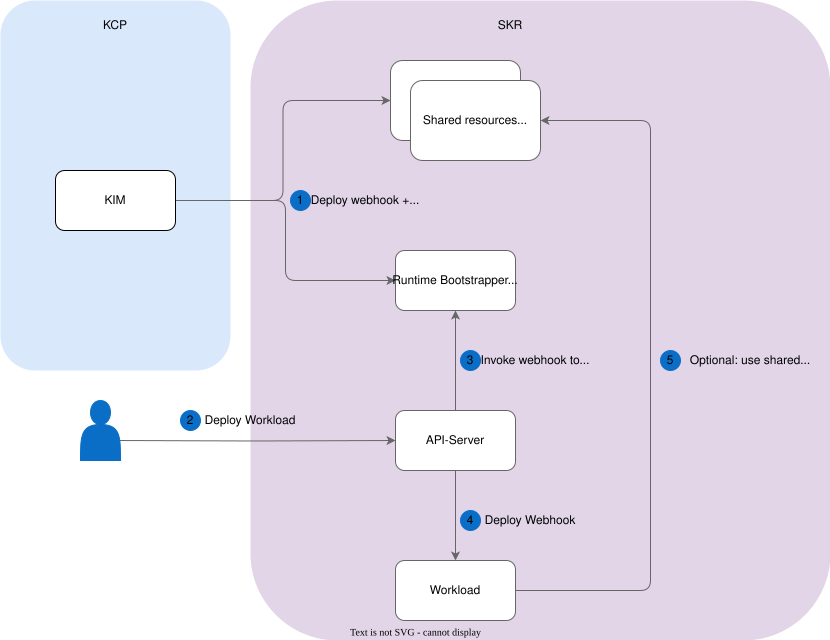

# Architectural Decisions

## Technical Design

Several architectural decisions were made during the Kyma architecture meeting and the implementation phase. These decisions were primarily driven by technical constraints and the need for timely solutions.

### High-Level Design

1. Kyma Infrastructure Manager (KIM) deploys the webhook and shared resources to Kyma runtimes.
2. The Kubernetes API server calls the manipulation webhook to intercept the Pod manifest before it gets applied.
3. Runtime Bootstrapper modifies Pod manifests and applies landscape-specific adjustments (for example, adding a pull Secret or rewriting image-registry hostnames).
4. The manipulated workload is adjusted to the landscape-specific setup.
5. (Optional) The workload can use shared resources (for example, pull Secrets and cluster trust bundles).

## Technical Requirements

### Manipulation Is Limited to Pods

The webhook only manipulates Pod resources. Other resources, such as StatefulSets, DaemonSets, and Deployments, are ignored. This is required to avoid conflicts between Kyma Lifecycle Manager (KLM) and Kyma Infrastructure Manager (KIM). KLM regularly processes the resources it deployed (for example, Deployments of operators). If the webhook were to modify these Deployments, KLM would revert the modifications regularly, and both processes would conflict with each other. To avoid such a situation, KLM never deploys Pods directly, but instead deploys high-level resources like Deployments, DaemonSets, and StatefulSets. The drawback of this decision is that the deployed Pod can include different values compared to its definition within a Deployment, StatefulSet, or DaemonSet, which may be confusing for engineers or developers reviewing a Pod definition in Kubernetes who are unaware of the webhook's existence and its adjustments.

### Non-Blocking Webhook

The admission webhook must be configured as a non-blocking processing step for API server requests. This means that the API server continues processing the request when the webhook cannot be invoked. This decision ensures that the API server continues to process requests even when the webhook is temporarily unavailable. The decision introduces the risk that Pods get scheduled without being manipulated.

### Detection of Non-Manipulated Resources Is Not Part of the Webhook

The webhook is exclusively responsible for manipulating the manifest of Pods during their creation phase. If a Pod gets scheduled without being processed by the webhook (for example, when the webhook is temporarily down), the Pod might miss critical adjustments and, in the worst case, may not start up properly. Detecting and remediating such Pods is out of scope for Runtime Bootstrapper itself. No automated process handles this; manual intervention is needed to identify unmanipulated Pods and restart them.

### Opt-In Approach

Pods are processed by the webhook only if one of the following conditions is met:

1. The configuration of the webhook defines a list of mandatory manipulations for the namespace. This ensures that any Pod in Kyma-managed namespaces is processed.
2. The namespace is annotated to receive particular manipulations.
3. The Pod itself is annotated to receive manipulations.

This also enables customers to opt into this modification mechanism by annotating either their own namespace or the Pod manifests accordingly.

### Webhook Configuration

The webhook retrieves a default configuration that specifies the list of manipulations to apply to all Pods in particular namespaces. Customers or other workloads cannot modify this configuration.

By default, the configuration considers only Kyma-managed namespaces (for example, `kyma-system` and `istio-system`) to avoid conflicts with customer-owned namespaces.

### Applied Manipulations

The webhook supports multiple manipulations. The default configuration, managed by KIM, determines which manipulations are applied. For a full description of each supported manipulation, see [Pod Manipulations](../02-01-pod-manipulations.md).

## Architecture Decision Records

- [ADR-001 – Intercept Only Pods, Not Higher-Level Resources](adr-001-intercept-only-pods.md)
- [ADR-002 – failurePolicy: Ignore (Non-Blocking Webhook)](adr-002-failure-policy-ignore.md)
- [ADR-003 – Configuration Using ConfigMap, No CRD](adr-003-configuration-via-configmap.md)
- [ADR-004 – Config Re-Read on Every Webhook Invocation](adr-004-config-re-read-on-every-invocation.md)
- [ADR-005 – Self-Managed caBundle Using certwatcher Callback](adr-005-self-managed-cabundle.md)
- [ADR-006 – Secret Synchronization as an Internal Controller](adr-006-secret-synchronization-internal-controller.md)
- [ADR-007 – Direct Runtime Configuration Synchronization](adr-007-direct-runtime-configuration-sync.md)

### Resource Synchronization

To adjust the workloads to landscape-specific setups, several resources must be published in the Kyma runtime:

1. Pull Secrets to authenticate at private container registries.
2. `ClusterTrustBundle` used to store certificate chains (needed for secured backend communication).
3. The configuration of the webhook itself.

The Kyma backend ensures that such resources are synchronized from Kyma Control Plane (KCP) to the Kyma runtime `kyma-system` namespace. For more information on this mechanism, see [Configuration Synchronization Using Controller Loop](../01-11-resource-synchronization.md).

Some resources are namespace-scoped and must be replicated to all other namespaces in the cluster (for example, pull secrets). The Runtime Bootstrapper webhook includes a dedicated controller that synchronizes such resources into all Kyma runtime namespaces.
