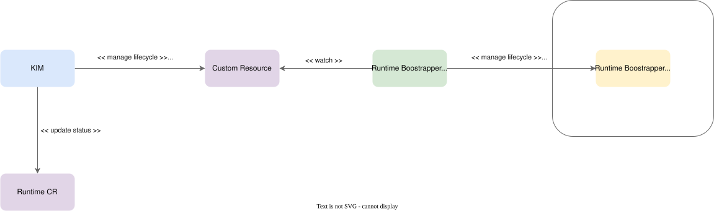

# ADR-007 – Direct Runtime Configuration Synchronization

**Status:** Proposed

**Context:** The current synchronization mechanism (described in [Configuration Synchronization Using Controller Loop](../01-11-resource-synchronization.md)) uses a Kubernetes controller loop that detects changes to shared resources (pull secret, `ClusterTrustBundle`, webhook ConfigMap) and signals Kyma Infrastructure Manager (KIM) by applying a label to `Runtime` CR objects. KIM then reconciles the target runtimes to propagate the updated configuration. This label-based signaling introduces an indirect dependency on KIM and adds latency, since propagation depends on KIM's reconciliation cycle rather than being driven directly by the change.

**Decision:** Replace the label-based signaling mechanism with a direct synchronization approach. The controller loop will propagate configuration changes to Kyma runtimes without involving KIM:

1. A dedicated CR will manage the full lifecycle of Runtime Bootstrapper on each runtime (install, status reporting, uninstall).
2. When a watched resource changes, the controller loop retrieves the updated value and writes it directly into the runtime's configuration or the associated Kubernetes objects.
3. KIM is no longer responsible for detecting label changes or reconciling these specific configuration types.

**Rationale:**

* **Reduced latency:** Changes are applied immediately without waiting for an external reconciliation loop.
* **Lower complexity:** Removes the indirection of using `Runtime` CR labels as a signaling channel and reduces KIM's reconciliation scope.
* **Improved consistency:** Runtimes always reflect the latest configuration; the propagation path is a single step.
* **Clearer separation of responsibilities:** The controller loop owns configuration propagation and Runtime Bootstrapper lifecycle; KIM focuses on Kyma runtime lifecycle and is unaware of Runtime Bootstrapper internals.

**Consequences:**

* KIM and Runtime Bootstrapper must be decoupled: existing synchronization code in KIM is refactored and moved into Runtime Bootstrapper.
* The controller loop must be extended to implement direct write logic for pull secrets, `ClusterTrustBundle`, and webhook ConfigMap on each runtime.
* KIM must no longer depend on `Runtime` CR label changes for these configuration types.
* Versioning or compatibility checks are required to avoid partial updates during the transition.
* Runtimes must be validated to safely accept live updates to trust bundles, pull secrets, and webhook configuration.
